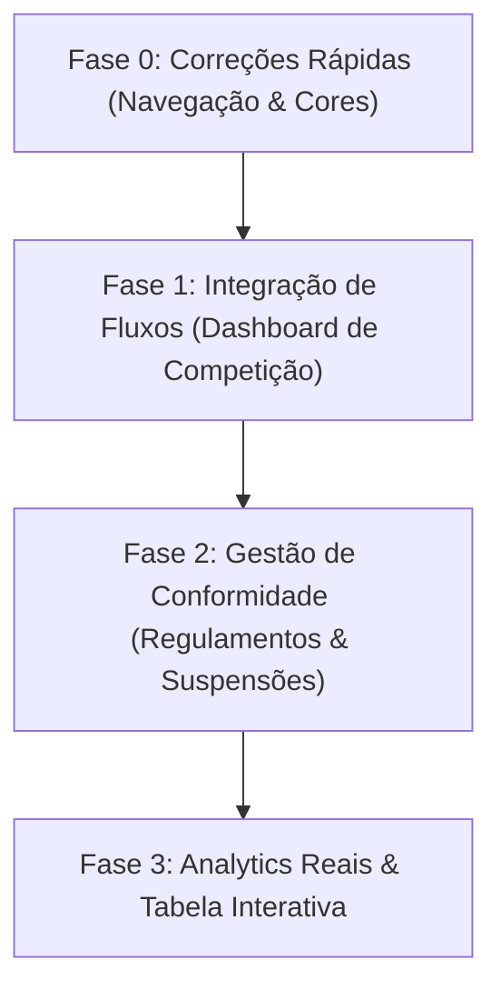

# AUDITORIA DE DASHBOARDS — TENANT & COMPETITION

**Ficheiro:** `dashboard_audit.md`  
**Versão:** 1.0.0  
**Estado:** Documento de Auditoria e Recomendações  
**Projeto:** Bolayetu — Football Ecosystem Platform  

---

## 1. Resumo Executivo

Esta auditoria analisa a integração e conformidade entre o **Dashboard do Tenant** (gerenciador global da organização) e o **Dashboard de Competições** (gerenciador das competições da organização), com base nos modelos de dados Django e nas diretrizes de negócio descritas em [01_BUSINESS_VISION.md](file:///D:/ndeascloud/boayetu/backend/docs/00-overview/01_BUSINESS_VISION.md).

Atualmente, embora existam APIs sólidas no backend (calculando estatísticas reais, controlando suspensões, filiações de clubes e transferências) e interfaces ricas no frontend, há **desconexões de navegação graves (becos sem saída)**, **falta de painéis administrativos dedicados para competições específicas** e **inconsistências de consistência visual** que impedem o correto funcionamento integrado do fluxo de trabalho operacional.

---

## 2. Gaps de Integração e UX/UI (Painel Geral vs. Painel de Competição)

### 2.1 Desconexão de Fluxo de Trabalho (Beco sem Saída)
*   **Tenant Dashboard para Competição:** No [OrganizationDashboardPage.tsx](file:///D:/ndeascloud/boayetu/frontend/src/modules/organizations/pages/OrganizationDashboardPage.tsx), a tabela "Competições Organizacionais" exibe a lista das competições da organização. No entanto, ao clicar numa competição, o utilizador é redirecionado para a página **pública** da competição (`/competitions/:id`) em vez do painel administrativo.
*   **Página Pública Sem Retorno:** Na página pública ([CompetitionDetailPage.tsx](file:///D:/ndeascloud/boayetu/frontend/src/modules/competitions/pages/CompetitionDetailPage.tsx)), mesmo que o utilizador seja um administrador (`isAdmin = true`), **não existe nenhum link ou botão** para voltar ao painel administrativo da competição (`/dashboard/competitions/:id/settings`, `registration` ou `schedule`). O utilizador fica "preso" na área pública e tem de introduzir o URL manualmente no navegador.
*   **Botão Incorreto de Criação:** No painel do Tenant, o botão de ação rápida "Publicar Nova Competição" aponta incorretamente para `ROUTES.COMPETITIONS` (listagem pública) em vez de `ROUTES.COMPETITION_CREATE` (`/dashboard/competitions/create`).

### 2.2 Perda de Contexto no Sidebar da Competição
*   No ficheiro [navigation.tsx](file:///D:/ndeascloud/boayetu/frontend/src/modules/competitions/constants/navigation.tsx), o menu lateral das páginas administrativas de uma competição específica (inscrições, calendário, definições) inclui o link "Geral" apontando para `/dashboard/competition`.
*   Ao clicar em "Geral", o utilizador é levado para o painel geral de competições (uma visão agregada de todo o tenant) e **perde o contexto da competição específica** que estava a gerir. O link deveria levar a um painel geral da *própria* competição ativa.

### 2.3 Mistura de Layouts Administrativos e Públicos
*   No mesmo menu lateral, os links para "Rankings" e "Suspensões" redirecionam para as rotas públicas (`/competitions/:id/rankings` e `/competitions/:id/suspensions`), o que faz com que o menu lateral administrativo **desapareça**, quebrando a consistência do layout.
*   Deveriam existir páginas administrativas separadas ou modulares com o `DashboardLayout` e `dashboardType="competition"` para gerir suspensões e visualizar classificações de forma avançada.

---

## 3. Gaps Funcionais Comparando com os Modelos do Backend

Vários comportamentos suportados pelos modelos do Django no backend não possuem qualquer interface no frontend:

| Modelo Backend | Funcionalidade do Modelo | Estado Atual no Dashboard / UI | Impacto / Gap |
| :--- | :--- | :--- | :--- |
| **`Standing`** | Recalcular classificações a pedido (*recalculable on demand*) | Inexistente (calcula apenas por triggers implícitos) | O administrador não consegue forçar a atualização imediata da tabela classificativa em caso de erro ou ajuste de dados. |
| **`CompetitionRegulation`** | Estados `Draft`, `Published`, `Archived`; controlo de versões; upload de ficheiros DAM | Apenas visualização pública de regulamentos já inseridos na base de dados | O organizador não consegue criar, atualizar, versionar ou arquivar regulamentos da competição através do dashboard. |
| **`PlayerSuspension`** | Estados `Pending`, `Active`, `Served`, `Cancelled`, `Appealed`; suspensões manuais e disciplinares | Apenas listagem pública de suspensões | O painel não permite suspender jogadores manualmente por infrações disciplinares extra-jogo, gerir recursos (Appeals) ou cancelar suspensões. |
| **`CompetitionRanking`** | Rankings do tipo Fair Play (Jogador e Clube), clean sheets, partidas disputadas, dados históricos | Apenas o "Top Marcadores" é renderizado na página de detalhes da competição | A proposta de valor de "dados estatísticos confiáveis" e "Conformidade e Fair Play" perde-se pela falta de visualização na UI. |
| **`MatchReport`** | Relatório detalhado do árbitro, sumário de golos, cartões e estatísticas | Parcial (existe a UI, mas com pouca flexibilidade de edição rápida) | Dificuldade de acesso rápido a partir dos painéis de controlo do torneio. |

---

## 4. Correções e Consistência de Design

### 4.1 Inconsistência de `dashboardType`
*   As páginas [OrganizationMembersPage.tsx](file:///D:/ndeascloud/boayetu/frontend/src/modules/organizations/pages/OrganizationMembersPage.tsx) (Membros) e [OrganizationAffiliationsPage.tsx](file:///D:/ndeascloud/boayetu/frontend/src/modules/organizations/pages/OrganizationAffiliationsPage.tsx) (Filiações) usam `dashboardType="federation"`.
*   O painel principal usa `dashboardType="organization"`.
*   **Impacto:** Isto altera dinamicamente o logótipo, o título de contexto e o estilo do menu lateral à medida que o utilizador navega, criando uma experiência visual instável. Ambas as páginas pertencem ao Tenant e devem usar `"organization"`.

### 4.2 API Mocks vs. Dados Reais
*   No ficheiro [dashboard.api.ts](file:///D:/ndeascloud/boayetu/frontend/src/modules/dashboards/services/dashboard.api.ts), a flag `VITE_ENABLE_DASHBOARD_MOCK` permite simular dados. Embora as correções da Fase D tenham removido mocks fixos (agora degradando graciosamente), os dashboards executivos, de federação e de liga continuam a carecer de maior profundidade na ligação com a API de analytics em ambientes de produção.

---

## 5. Recomendações de Novas Implementações e Melhorias

Para que os dashboards cumpram a visão de negócio e integrem perfeitamente as operações, propomos as seguintes implementações:

### 5.1 Criação do Painel Administrativo de Competição Específica (`/dashboard/competitions/:id`)
1.  **Dashboard Único por Competição:** Desenvolver a página `CompetitionAdminDashboardPage.tsx` que centralize as informações de uma única competição (KPIs de clubes inscritos, jogos pendentes, jogos em curso, estatísticas e acessibilidade rápida para gerar calendário e submeter relatórios).
2.  **Mapeamento de Rotas no Sidebar:** Atualizar o link "Geral" em `navigation.tsx` para direcionar para `/dashboard/competitions/:id`, e não para o ecrã genérico `/dashboard/competition`.
3.  **Botão de Administração no Detalhe Público:** Adicionar um botão destacado "Administrar Competição" na página pública para utilizadores com permissão, permitindo alternar de volta ao painel com facilidade.

### 5.2 Implementação do Painel de Conformidade e Fair Play
*   **Gestão de Regulamentos (UI):** Adicionar um formulário na página de definições da competição para upload de regulamentos (em PDF/Documento integrado com o DAM) com seleção de versão e estado.
*   **Painel de Nomeação Arbitral e Conformidade:** Ativar o botão atualmente desativado em `CompetitionDashboardPage` e ligar ao fluxo de escala e vistoria dos recintos.
*   **Consola de Suspensões (Admin):** Criar uma área administrativa sob `/dashboard/competitions/:id/suspensions` que permita aos administradores aprovar recursos (Appeals), ver o histórico disciplinar e criar suspensões manuais/disciplinares.

### 5.3 Ligar Actions no Tabela do Tenant Dashboard
*   Atualizar a coluna de ações da tabela de competições no `OrganizationDashboardPage` para incluir um botão "Gerir" (direcionando para o painel da competição) e "Definições" (direcionando para `/dashboard/competitions/:id/settings`).

---

## 6. Plano de Ação Recomendado (Roadmap de Implementação)

### Fase 0: Correções Rápidas (Navegação & Cores)
*   Corrigir o `dashboardType` nas páginas de Membros e Filiações para `"organization"`.
*   Corrigir o link de "Publicar Nova Competição" para apontar para `/dashboard/competitions/create`.
*   Adicionar botão "Painel Administrativo" na página de detalhes públicos para administradores autenticados.

### Fase 1: Integração de Fluxos (Dashboard de Competição)
*   Criar o layout administrativo exclusivo por ID de competição.
*   Refatorar o menu lateral `getCompetitionSidebarLinks` para usar rotas administrativas internas de Rankings e Suspensões, em vez de saltar para as públicas.
*   Ligar a ação "Gerir" na tabela de competições do Tenant.

### Fase 2: Gestão de Conformidade (Regulamentos & Suspensões)
*   Criar a interface CRUD para `CompetitionRegulation` usando o serviço DAM do backend.
*   Criar o painel administrativo de `PlayerSuspension` para cancelamento, aplicação manual e visualização do estado da suspensão (matches remaining).

### Fase 3: Analytics Reais & Tabela Interativa
*   Substituir dados estáticos residuais no frontend.
*   Adicionar botão "Recalcular Classificações" chamando o endpoint do backend de `StandingService`.
