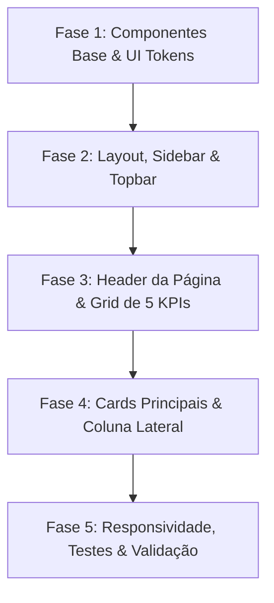

Com base na auditoria visual e de experiência de utilização apresentada em `dashboard_ux_audit_redesign.html` e na estrutura atual do frontend em `OrganizationDashboardPage.tsx`, apresento o **Plano de Implementação por Fases**.

---

### Objetivos Principais da Refatoração
1. **Eliminar ruído visual e colisão de elementos:** Unificar o cabeçalho da página, remover repetições de nomes/títulos e estabelecer hierarquia visual clara.
2. **Padronização de tipografia:** Migrar de `ALL CAPS` / `Title Case` para `Sentence case`.
3. **Grid de KPIs uniforme e semântico:** Grid 5 colunas com cores dedicadas por entidade e suporte a estado neutro quando o valor for 0.
4. **Sidebar e Topbar contextualizados:** Corrigir ícones, contadores/badges de alertas e identificação precisa da entidade ativa.
5. **Empty states e Ações Rápidas refinados:** Eliminar cortes de texto, modernizar os cartões e adicionar microinterações consistentes.

---

---

### Fase 1: Componentes Base & UI Tokens
**Foco:** Garantir que os componentes fundamentais suportam os novos estados visuais e paletas semânticas.

1. **Evolução do componente KPI Card** em `kpi-card.tsx`:
   - Adicionar variante semântica de cor para o contentor do ícone (`teal`, `blue`, `purple`, `amber`, `danger`/`coral`).
   - Suportar estado de tendência `neutral` (ex.: `"Sem dados ainda"` com ícone `Minus` e cor suave).
   - Substituir `uppercase tracking-wider` por `Sentence case` com peso visual balanceado (`font-medium text-xs`).
2. **Padronização de Empty States** em `empty-state.tsx`:
   - Estrutura com ícone circular destacado, título em destaque, descrição explicativa e botão de ação compacto (`btn-primary` ou `btn-outline`).

---

### Fase 2: Navegação, Sidebar e Topbar
**Foco:** Corrigir inconsistências contextuais e navegação semântica.

1. **Limpeza da Navegação da Organização** em `navigation.tsx`:
   - Ajustar rótulos para sentence case:
     - `"Submissões de Escalações"` $\rightarrow$ `"Submissões"`
     - `"Clubes Associados"` $\rightarrow$ `"Clubes associados"`
     - `"Jogadores Registados"` $\rightarrow$ `"Jogadores"`
     - `"Pedidos de Filiação"` $\rightarrow$ `"Pedidos de filiação"`
   - Integrar suporte a contador dinâmico de filiações e submissões pendentes (`badge count`).
2. **Sidebar & Entity Header** em `DashboardSidebar.tsx` e `SidebarEntityHeader.tsx`:
   - Ajustar exibição do cabeçalho de entidade: iniciais ou logo com fundo verde/teal institucional, nome da entidade e subtítulo `"Organização"` sem duplicação de texto.
   - Ajustar rodapé do sidebar: ícone correto de logout (`LogOut`), perfil de utilizador conciso e rótulo `"Terminar sessão"`.
3. **Refinamento do Topbar** em `DashboardHeader.tsx`:
   - Pill de inquilino global com ícone de globo e estilo mais discreto.
   - Badge de notificações com ponto vermelho indicador de estado.
   - Perfil de utilizador simplificado em pílula com avatar, nome e função.

---

### Fase 3: Cabeçalho da Página e Grid 5x de KPIs
**Foco:** Resolver a colisão visual superior em `OrganizationDashboardPage.tsx`.

1. **Page Header unificado:**
   - Título principal com o nome da organização (ex.: `"FC Sport"`).
   - Subtítulo explicativo: `"Painel administrativo · gestão de clubes, competições e estatísticas"`.
   - Ações de topo à direita: `"Convidar membro"` (outline) e `"Nova competição"` (primary).
2. **Grid de 5 KPIs Uniforme:**
   - Substituir a lista flex assimétrica por `grid grid-cols-1 sm:grid-cols-2 lg:grid-cols-5 gap-3`.
   - **Orgs. afiliadas:** Ícone `Users` (fundo teal `#e1f5ee`, ícone `#0f6e56`), tendência `+2% este mês`.
   - **Clubes ativos:** Ícone `Building2` (fundo blue `#e6f1fb`, ícone `#185fa5`), status neutro quando 0.
   - **Jogadores:** Ícone `User` (fundo purple `#eeedfe`, ícone `#534ab7`), status neutro quando 0.
   - **Competições:** Ícone `Trophy` (fundo amber `#faeeda`, ícone `#854f0b`), status neutro quando 0.
   - **Transf. pendentes:** Ícone `ArrowLeftRight` (fundo coral `#fcebeb`, ícone `#a32d2d`), aviso `"Aguardam revisão"`.

---

### Fase 4: Conteúdo Principal e Coluna Lateral
**Foco:** Disposição limpa das tabelas e widgets secundários.

1. **Coluna Principal (8 colunas em desktop):**
   - **Card de Competições Organizacionais:** Tabela com cabeçalho limpo, paginação e empty state interativo direcionando para criação.
   - **Card de Clubes Associados:** Listagem de clubes com status ativo e empty state direcionando para vinculação.
2. **Coluna Lateral (4 colunas em desktop):**
   - **Card de Transferências:** Resumo das movimentações recentes com link de visualização direta.
   - **Grid de Ações Rápidas (2x2):**
     - *Vincular clube* (ícone verde / estádio)
     - *Nova competição* (ícone azul / troféu)
     - *Convidar membro* (ícone roxo / utilizador)
     - *Rever filiações* (ícone âmbar / link)
     - Redução do tamanho dos textos descritivos para evitar truncamento.
   - **Card de Atividade Recente:** Feed vertical com pontos coloridos por categoria de evento e carimbo temporal relativo.

---

### Fase 5: Responsividade, Testes e QA Visual
**Foco:** Garantir estabilidade técnica e paridade com a especificação visual.

1. **Adaptação Responsiva:**
   - Mobile ($< 640\text{px}$): KPIs em stack vertical de 1 coluna, ações rápidas em 1 coluna.
   - Tablet ($640\text{px} - 1024\text{px}$): KPIs em 2 colunas, ações rápidas em 2 colunas.
   - Desktop ($\ge 1024\text{px}$): Grid de 5 colunas para KPIs e layout $8+4$ para a área de conteúdo.
2. **Testes Unitários e de Integração:**
   - Atualizar testes de renderização do dashboard em `OrganizationDashboardPage.tsx`.
   - Validar contagens de badges e links de navegação.

---

### Próximos Passos Sugeridos

Podemos iniciar pela **Fase 1 e Fase 2** (ajustes no `kpi-card.tsx` e `navigation.tsx`) ou avançar diretamente para a refatoração completa do layout e do dashboard na **Fase 3 e Fase 4**. Qual abordagem prefere priorizar?